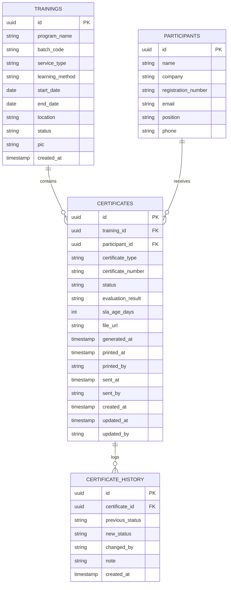

# BKI Academy Platform — System Architecture, Data Flow, & Upgrade Blueprint

Dokumen ini menyajikan ringkasan menyeluruh mengenai arsitektur sistem, implementasi teknis (Frontend & Backend), alur pemrosesan data (*data treatment*), serta analisis strategis dan peta jalan (*upgrade roadmap*) untuk mengembangkan platform **BKI Academy** dari sekadar *Certificate Tracking* menjadi **Enterprise Training & Academy Management System (TMS/LMS)** yang terintegrasi.

---

## 1. Executive Summary & Ringkasan Sistem Saat Ini

Platform saat ini adalah **BKI Academy Certificate Management System (CMS)**. Sistem ini dibangun untuk menyelesaikan masalah pasca-pelaksanaan pelatihan (*post-training operational bottleneck*), khususnya pemantauan siklus hidup sertifikat, pelacakan SLA (*Service Level Agreement*), pembagian beban kerja PIC (*Person in Charge*), dan pencatatan riwayat audit (*audit trail*).

### Tech Stack Utama
| Komponen | Teknologi | Versi / Keterangan |
| :--- | :--- | :--- |
| **Framework Web** | Next.js (App Router) | v16.3.3 |
| **UI Library** | React | v19.2.8 |
| **Bahasa Pemrograman** | TypeScript | v5 |
| **Styling & CSS** | Tailwind CSS & PostCSS | v4.x + Custom Design Tokens |
| **Database & Auth** | Supabase (PostgreSQL) | `@supabase/supabase-js` v2.109.0 |
| **Data Validation** | Zod | v4.4.3 |
| **Iconography & Fonts** | Material Symbols & Inter Font | Google Fonts CDN |
| **Storage & Fallback** | Hybrid LocalStorage | Offline/Mock Mode jika DB terputus |

---

## 2. Arsitektur Frontend

Arsitektur antarmuka dibangun menggunakan paradigma **Single Page Application (SPA)** di dalam ekosistem **Next.js App Router** (`src/app/`), di mana seluruh halaman memanfaatkan komponen sisi klien (`'use client'`) untuk interaksi real-time tanpa *full-page reload*.

### A. Struktur Halaman & Routing
```
src/app/
├── page.tsx                  # Login screen (Supabase Auth + fallback mock)
├── layout.tsx                # Root layout, Google Fonts (Inter, Material Symbols)
├── globals.css               # Design tokens, CSS variables, utility classes
├── dashboard/
│   └── page.tsx              # KPI cards, visual pipeline, charts, recent activities
├── trainings/
│   ├── page.tsx              # Batch list, multi-filter, manual create, CSV import & preview
│   └── [id]/
│       └── page.tsx          # Training Hub: Overview, Participants, Kanban board, Activity
├── certificates/
│   └── page.tsx              # Global cert monitoring, SLA age filter, CSV export
├── history-logs/
│   └── page.tsx              # Unified audit log (Trainings created, Certs generated & moved)
├── reports/
│   └── page.tsx              # SLA compliance metrics per PIC, delay causes, monthly trends
└── settings/
    ├── layout.tsx            # Settings navigation tab shell
    ├── profile/page.tsx      # Update admin profile name
    ├── notifications/page.tsx# SLA breach alerts & reminder preferences
    ├── security/page.tsx     # Change password & session management
    └── system/page.tsx       # SLA threshold config, dynamic Supabase credentials, user provisioning
```

### B. Pola State Management & Reaktivitas
1. **Global Auth Context (`src/context/AuthContext.tsx`)**:
   - Memantau sesi aktif pengguna via `supabase.auth.getSession()` dan listener `onAuthStateChange`.
   - Mengelola fallback ke `localStorage` (`bki_mock_session`) jika mode *mock* aktif.
2. **Real-time Event Synchronization (`bki-db-update`)**:
   - `src/lib/db.ts` memicu custom DOM event: `window.dispatchEvent(new Event('bki-db-update'))` pada setiap mutasi data (create, update, delete, drag-and-drop).
   - Halaman aktif menangkap event ini via `addEventListener` untuk melakukan *silent re-fetch*, menjamin data selalu sinkron antar-komponen tanpa *page reload*.
3. **Komponen Modular & Layout Shell**:
   - `DashboardLayout.tsx`: Menyediakan shell responsif dengan Sidebar terfiksasi di kiri dan Header di atas.
   - `Sidebar.tsx`: Menampilkan profil admin yang dinamis, navigasi rute aktif, dan brand BKI Academy.
   - `Header.tsx`: Menampilkan judul halaman dinamis, waktu terkini, notifikasi, dan profil logout.
   - `ConfirmationModal.tsx`: Modal konfirmasi seragam untuk tindakan destruktif (delete batch, remove participant, bulk shift).

---

## 3. Arsitektur Backend & Database

Backend saat ini mengusung pendekatan **Backend-as-a-Service (BaaS)** berbasis **Supabase** yang terhubung langsung dari layer klien, dilengkapi dengan arsitektur **Hybrid Resilience (Offline Fallback)**.

### A. Pola Koneksi Supabase Dinamis (`src/lib/db.ts`)
Koneksi ke Supabase diinisialisasi secara dinamis dengan urutan prioritas:
1. Pengecekan override di `localStorage` (`supabase_url`, `supabase_key`) yang dapat dikonfigurasi langsung dari menu `/settings/system`.
2. Jika kosong, membaca environment variable: `NEXT_PUBLIC_SUPABASE_URL` dan `NEXT_PUBLIC_SUPABASE_ANON_KEY`.
3. Jika kredensial belum tersedia atau jaringan offline, sistem secara otomatis mengalihkan *read/write operations* ke `localStorage` dengan *mock seed data* bawaan.

### B. Skema Database Relasional (PostgreSQL di Supabase)



### C. Deskripsi Entitas Data
1. **`trainings`**: Menyimpan metadata batch pelatihan (nama program, kode batch, jenis layanan: *Public Training* / *In-House*, metode: *Offline* / *Online*, rentang tanggal pelaksanaan, lokasi, status batch, serta nama PIC operasional).
2. **`participants`**: Direktori master peserta. Memiliki *composite unique key* logika pada kombinasi `(name, company)` untuk mencegah duplikasi peserta saat import CSV berulang.
3. **`certificates`**: Inti transaksi sistem. Menghubungkan peserta dengan pelatihan, mendefinisikan tipe sertifikat (`Qualification` atau `Attendance`), nomor registrasi sertifikat resmi, status pemrosesan, hasil evaluasi (`Lulus` / `Tidak Lulus`), SLA age, serta timestamp *lifecycle* (kapan dicetak dan dikirim beserta siapa PIC eksekutornya).
4. **`certificate_history`**: Tabel log audit permanen. Merekam setiap transisi status (misal: `Pending` $\to$ `Processing` $\to$ `Printing` $\to$ `Completed`), aktor yang mengubah, catatan, dan timestamp presisi.

---

## 4. Alur & Perlakuan Data (Data Treatment & Workflow)

Bagian ini menjelaskan bagaimana data masuk, diproses, divalidasi, dan ditransformasikan di dalam sistem.

### A. Ingestion & Normalisasi CSV/Excel (`src/lib/csv.ts`)
BKI Academy sering menerima agenda batch pelatihan dalam bentuk file spreadsheet kotor (*unstructured / merged-cell style*). Modul `csv.ts` dilengkapi logika normalisasi khusus:
1. **Forward-Fill & Multi-row Grouping**:
   - Jika kolom `No Urut Proyek` atau `Obyek/Nama Pelatihan` terisi, baris-baris berikutnya yang berkaitan dikelompokkan ke dalam satu batch yang sama meskipun baris-barisnya terpisah (*non-contiguous*).
2. **Parser Tanggal Bahasa Indonesia (`resolveDatesFromText`)**:
   - Membaca format natural seperti `"03 - 05 Agustus"` dan mengonversinya menjadi format ISO standard (`2026-08-03` s/d `2026-08-05`).
3. **Sanitasi Keamanan & Anti CSV-Injection (`src/lib/safety.ts`)**:
   - **Formula Injection Mitigation**: Jika sel diawali karakter bahaya (`=`, `+`, `-`, `@`, `\t`, `\r`), sistem menyematkan tanda kutip tunggal (`'`) di depannya agar spreadsheet reader (Excel/Calc) tidak mengeksekusi rumus berbahaya.
   - **XSS Escaping**: Mengonversi karakter `&`, `<`, `>`, `"`, `'` menjadi HTML entities.
4. **Skema Validasi Zod (`trainingSchema`)**:
   - Validasi data ketat pada input manual: validitas tanggal (`end_date >= start_date`), panjang string, dan format status.
5. **Deduplikasi Cerdas saat Sinkronisasi**:
   - Sebelum menyimpan ke Supabase, sistem memeriksa apakah program dan kode batch sudah ada. Jika sudah ada, sistem tidak membuat batch baru melainkan menggunakan batch yang sudah terdaftar (*link to existing*).
   - Peserta di-*upsert* berdasarkan kecocokan nama dan perusahaan.

### B. Lifecycle Sertifikat & State Machine
Sertifikat mengikuti alur tahapan Kanban:

$$\text{Pending (25\%)} \longrightarrow \text{Processing (50\%)} \longrightarrow \text{Printing (75\%)} \longrightarrow \text{Completed (100\%)}$$

- **Bobot Progres Dinamis**: Persentase kemajuan batch dihitung secara terbobot berdasarkan status individual setiap sertifikat.
- **Drag & Drop Interaktif**: Perubahan status dapat dilakukan dengan menyeret kartu sertifikat antar kolom Kanban pada halaman `trainings/[id]`.
- **Bulk Shifting**: Fitur pemindahan massal seluruh sertifikat dalam satu kolom ke tahap berikutnya atau sebelumnya (dapat difilter khusus sertifikat Kualifikasi atau Kehadiran).
- **Auto-Audit Logging**: Setiap perpindahan kolom secara otomatis menulis entri audit baru ke tabel `certificate_history` lengkap dengan nama admin yang sedang login.

### C. Logika Perhitungan SLA & Overdue
- **SLA Threshold Dinamis**: Nilai ambang batas SLA tersimpan di preferensi sistem (default: **4 hari kerja**).
- **Deteksi Keterlambatan (*Overdue*)**:
  $$\text{IsOverdue} = (\text{status} \neq \text{'Completed'}) \land (\text{sla\_age\_days} > \text{slaThreshold})$$
- **PIC SLA Metrics**: Menghitung rasio kepatuhan (*compliance rate*) dan rasio overdue per masing-masing PIC untuk dievaluasi oleh manajemen pada halaman `/reports`.

---

## 5. Analisis Limitasi & Celah Sistem Saat Ini

Meskipun sistem pelacakan sertifikat saat ini sudah berjalan baik, terdapat beberapa keterbatasan arsitektural yang menjadi kendala jika ingin di-upgrade menjadi platform Academy menyeluruh:

| Aspek | Kondisi Saat Ini | Kebutuhan untuk Full Academy |
| :--- | :--- | :--- |
| **Arsitektur Rendering** | Hampir 100% Client-Side (`'use client'`). Direct client-to-Supabase query. | Perlu Next.js Server Components, Server Actions, & Route Handlers untuk keamanan kredensial dan performa SEO. |
| **Security & RLS** | Belum ada Row Level Security (RLS) ketat; otentikasi hanya mengandalkan kontrol layer frontend. | Harus menerapkan RLS di PostgreSQL untuk membedakan hak akses Admin, Trainer, Corporate Client, dan Peserta. |
| **File Storage & Engine** | Sertifikat hanya dicatat nomor dan statusnya (kolom `file_url` masih opsional). | Membutuhkan Dynamic PDF Generation engine (menggunakan Puppeteer / `@react-pdf/renderer`) dan Supabase Storage bucket. |
| **Verifikasi Publik** | Belum ada halaman verifikasi publik untuk pihak ketiga / rekruiter. | Diperlukan halaman publik `/verify/[certNumber]` dengan verifikasi QR Code dan anti-tamper hash. |
| **Entitas Kursus / Materi** | Tidak ada master Course, Modul, Silabus, atau Jadwal Sesi Harian. | Memerlukan modul Course Management & Learning Management System (LMS). |
| **Instruktur / Trainer** | Belum ada profil Trainer, honorarium/rate, ketersediaan jadwal, atau evaluasi trainer. | Memerlukan modul Trainer Management. |
| **Transaksi & CRM** | Belum ada pencatatan penawaran (*quotation*), invoice, status pembayaran peserta / B2B corporate client. | Memerlukan modul Enrollment & Invoicing / Payment Gateway. |
| **Role-Based Portal** | Hanya ada tampilan untuk Admin Training. | Dibutuhkan Student Portal (peserta login untuk akses materi/sertifikat) & Corporate Dashboard (HRD perusahaan melihat progres karyawannya). |

---

## 6. Blueprint & Rencana Upgrade: Menuju "BKI Academy Enterprise Platform"

Untuk mentransformasikan website ini dari sekadar **Certificate Tracking** menjadi **Integrated Academy & Training Management System (TMS + LMS)**, berikut adalah arsitektur rekomendasi yang dirancang secara bertahap:

```
+---------------------------------------------------------------------------------------+
|                                  BKI ACADEMY ECOSYSTEM                                 |
+---------------------------------------------------------------------------------------+
        │                                 │                                 │
        ▼                                 ▼                                 ▼
┌──────────────────┐             ┌──────────────────┐             ┌──────────────────┐
│   ADMIN / OPS    │             │  TRAINER PORTAL  │             │  STUDENT / B2B   │
│  Management Hub  │             │ Attendance & Eval│             │  Self-Service    │
└────────┬─────────┘             └────────┬─────────┘             └────────┬─────────┘
         │                                │                                │
         └────────────────────────────────┼────────────────────────────────┘
                                          │
                                          ▼
                      ┌───────────────────────────────────────┐
                      │    Next.js 16 App Router Core API     │
                      │  (Server Actions, RLS, Auth, Workers) │
                      └───────────────────┬───────────────────┘
                                          │
            ┌─────────────────────────────┼─────────────────────────────┐
            ▼                             ▼                             ▼
  ┌───────────────────┐         ┌───────────────────┐         ┌───────────────────┐
  │ Training & LMS    │         │ Credential Engine │         │ CRM & Commercial  │
  │ • Course Catalog  │         │ • Auto PDF Gen    │         │ • B2B Company Acc │
  │ • Class Schedule  │         │ • QR Verification │         │ • Invoicing & Pay │
  │ • Quizzes / Eval  │         │ • Hash / Badges   │         │ • Registration    │
  └───────────────────┘         └───────────────────┘         └───────────────────┘
```

### Tahap 1: Ekstensi Skema Database (Database Modernization)
Tambahkan tabel-tabel berikut ke Supabase:
1. **`courses`**: Master katalog training (judul, deskripsi, silabus, durasi jam pelajaran, kategori sertifikasi: Maritim, QHSE, Manajemen).
2. **`trainers`**: Data pengajar/instruktur (spesialisasi keilmuan, nomor sertifikasi pengajar, tarif harian/jam, kontak).
3. **`training_schedules`**: Jadwal per hari/sesi, link zoom/lokasi ruangan, PIC instruktur yang ditugaskan.
4. **`attendances`**: Presensi harian peserta (bukan hanya status akhir).
5. **`companies` / `corporate_clients`**: Data klien perusahaan (PT Pertamina, Pelindo, dll.) untuk mengelompokkan peserta B2B.
6. **`invoices` & `payments`**: Pencatatan tagihan, nominal biaya, PPN, dan bukti pembayaran pelatihan.
7. **`evaluations` & `quizzes`**: Nilai pre-test, post-test, penugasan, serta kuesioner evaluasi terhadap pengajar dan fasilitas.

### Tahap 2: Mesin Sertifikat Digital & Verifikasi Terbuka (Digital Credentialing)
1. **Automated PDF Rendering**:
   - Integrasi pustaka pembuat dokumen (seperti `@react-pdf/renderer` atau template headless Chrome).
   - Menghasilkan PDF sertifikat resolusi cetak dengan background template resmi BKI Academy.
2. **Public Verification Portal (`/verify/[certificate_number]`)**:
   - Halaman verifikasi publik tanpa perlu login.
   - Menyematkan QR Code unik di setiap sertifikat fisik/PDF yang mengarah langsung ke URL verifikasi.
   - Menampilkan status keaslian sertifikat, tanggal terbit, nama peserta, dan kompetensi yang diraih.
3. **Supabase Storage Integration**:
   - Menyimpan file PDF hasil *generate* ke dalam bucket storage terproteksi (`certificate-files/`).

### Tahap 3: Portal Multi-Peran (Multi-Role Experience)
1. **Role: Admin / Operations (Tampilan Saat Ini)**:
   - Mengelola batch, memantau SLA, mengontrol keuangan & PIC.
2. **Role: Trainer / Assessor**:
   - Login untuk melihat jadwal mengajarnya, mengisi absensi harian, dan memasukkan nilai evaluasi/ujian peserta.
3. **Role: Student / Participant (Portal Peserta)**:
   - Login menggunakan No. Registrasi / Email.
   - Mengunduh materi slide pelatihan, mengisi kuis / evaluasi, dan mengunduh e-Certificate resmi secara mandiri jika status sudah *Completed*.
4. **Role: Corporate HRD (B2B Client Dashboard)**:
   - Dashboard bagi PIC Perusahaan mitra BKI untuk memonitor progres pelatihan karyawan mereka, rekap sertifikat batch perusahaan, dan status tagihan invoice.

### Tahap 4: Notifikasi & Otomasi Operasional
1. **Automated SLA Watcher (Cron Job)**:
   - Menggunakan Supabase Edge Functions atau Next.js Cron (Vercel Cron) yang berjalan setiap hari pukul 08:00 WIB.
   - Otomatis menghitung penambahan `sla_age_days` dan mengirimkan email peringatan (*SLA breach warning*) kepada PIC terkait jika status sertifikat melebihi 4 hari belum selesai.
2. **Integrasi Email Transaksional (Resend / SendGrid / NodeMailer)**:
   - Mengirim email otomatis ke peserta saat sertifikat mereka selesai diterbitkan lengkap dengan tautan download / verifikasi.

---

## 7. Kesimpulan & Rekomendasi Langkah Selanjutnya

Fondasi yang ada pada codebase saat ini sudah sangat rapi, terstruktur, dan memiliki *design system* yang elegan. Perpindahan dari vanilla HTML ke Next.js 16 + TypeScript + Supabase telah meletakkan pondasi kode yang siap untuk ekspansi.

**Rekomendasi langkah prioritas berikutnya:**
1. **Prioritas 1 (Quick Win)**: Bangun fitur **Public Certificate Verification (`/verify/[id]`)** dan pasang QR Code pada nomor sertifikat.
2. **Prioritas 2**: Tambahkan backend storage (Supabase Storage) & auto-generator PDF agar sertifikat bukan sekadar status teks melainkan dokumen fisik yang dapat diunduh.
3. **Prioritas 3**: Mulai perluas skema database dengan membuat relasi ke **Courses/Katalog Materi** dan **Companies (B2B)** untuk menyongsong evolusi menjadi Full Academy Platform.
